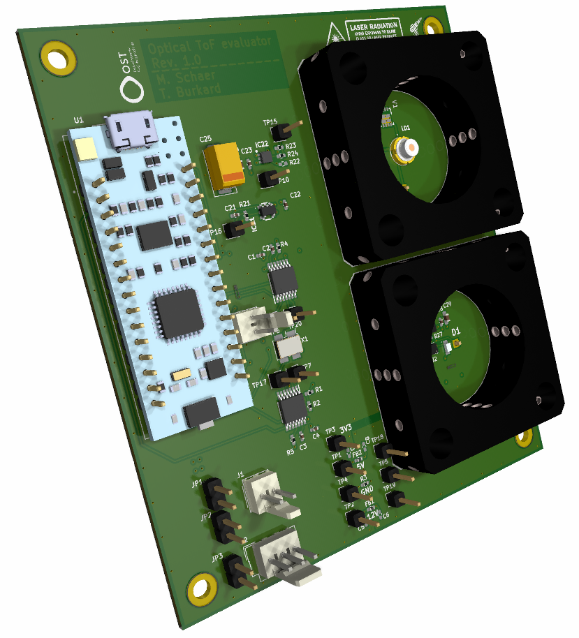

# DIY ToF

(C) 2024 Matthias Schär, Timon Burkard

This project is about creating a DIY (Do-It-Yourself) optical ToF (Time of Flight) distance measurement system.

It is a project work as part of the CAS (Certificate of Advanced Studiers) in Sensors and Sensor Signal Conditioning, which is held at OST (Ostschweizer Fachhochschule) in Rapperswil CH.
